## Introduction

The Stock Assessment Continuum Tool uses Stock Synthesis (SS3; Methot and Wetzel 2013) to implement a variety of stock assessment configurations. This tool was initially built to implement several standard data-limited assessment methods within the SS3 modeling framework, but also has the ability to implement more complex and data-rich configurations. The concept of the stock assessment continuum (Cope 2024) argues that stock assessment methods exist along a continuum based on data availability. So instead of moving to different modelling platforms once additional data types become available, one platform can be used, thus creating a system of common inputs and outputs, allowing the investigation of information content of data types, and how integrating the different data types bring different population signals together. It promotes critical evaluation of currently available data and gap analyses of what could be done with more and/or different data.

The SAC Tool aims to be a convenient platform for this theory while also being an accessible way to create Stock Synthesis input files by using [simplified data input files](https://github.com/shcaba/SS-DL-tool/tree/master/Example%20data%20files) and user inputted life history information, resulting in a running SS3 model with all of its needed files. This integrated framework allows additional data to be systematically added or subtracted, thus allowing access to a variety of stock assessment methods within one unified modelling system. It also provides easy access to a variety of SS3 options to add complexity and a way to run customized Stock Synthesis models modified via the SS3 input files (basic SS3 input files used in the SAC Tool are found [here](https://github.com/shcaba/SS-DL-tool/tree/master/SS_LB_files)).

Some of the common model-based stock assessment featured within the SAC Tool are:

- Length/age-only

- Catch-only

- Production models

- Catch and length models

- Fully-integrated models

For more information on how to use the tool and on the concept of the stock assessment continuum, please see this [video](https://www.youtube.com/watch?v=NFJPoFJ9qyo) and the [GitHub repository](https://github.com/shcaba/SS-DL-tool/tree/master) for installation details. For specific information on using Stock Synthesis 3, please see the [SS3 manual](https://nmfs-ost.github.io/ss3-doc/SS330_User_Manual_release.html).

## Method description

### Inputs

There are four commonly used stock assessments data inputs that can be loaded directly into the SAC Tool. Not all are needed, and any combination of the four can be used to construct a model. Below are stills from the SAC Tool to accompany the description of inputs.

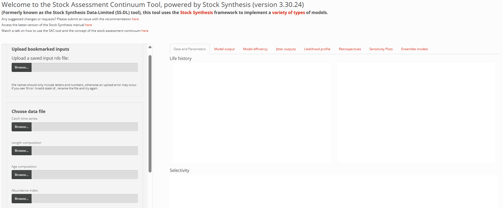

1.  Removals (i.e., catch and dead discards). These are always entered as metric tons.

2.  Length compositions. Presented as frequency or proportion of length by data length bin and always in centimeters.

    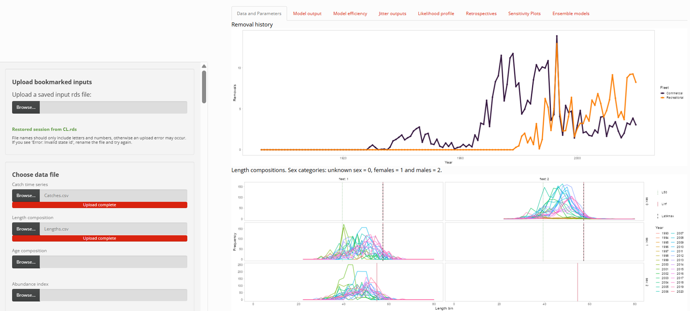

3.  Age compositions. Ages can be included either as marginal composiotions or as ages conditions conditioned on lengths. The latter means there is a distribution of ages by length bin, and allows for the simultaneous use of length and age composition data.

    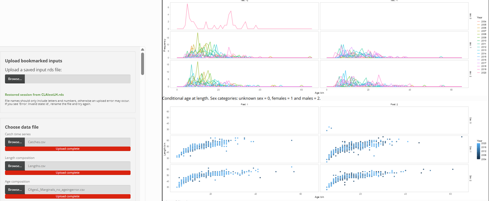

4.  Abundance indices. These can be either absolute or relative (as distinguished by the catchability value) indices of abundance, and can be fishery-dependently or -independently sourced.

    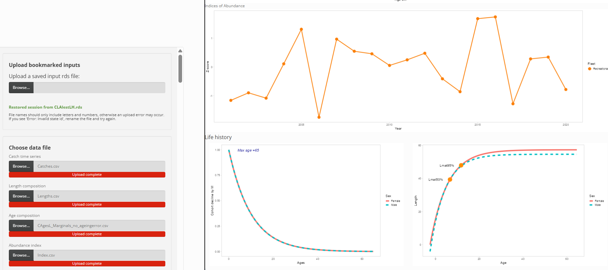

Each of these data inputs can be assigned to different fleets. This allows sophisticated treatments of data sources to capture important technical interactions of fishing fleets or scientific sampling with the stock. Fleet are defined by different length-based selectivities. A flexible selectivity curve allows logistic and dome-shaped selectivity to be specified and explored. This can overcome some of the strong assumptions on selectivity made in other data-limited models using the same data.

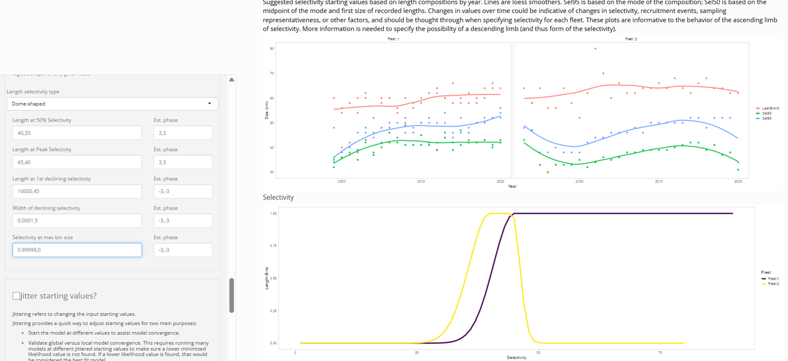

In addition to the data and selectivity inputs above, life history inputs are also required. This includes natural mortality, growth (in the default form of the von Bertalanffy growth function), logistic maturity and recruitment compensation (assumed as the Beverton-Holt steepness value). Length-weight relationships and fecundity are also required for models that use removals.

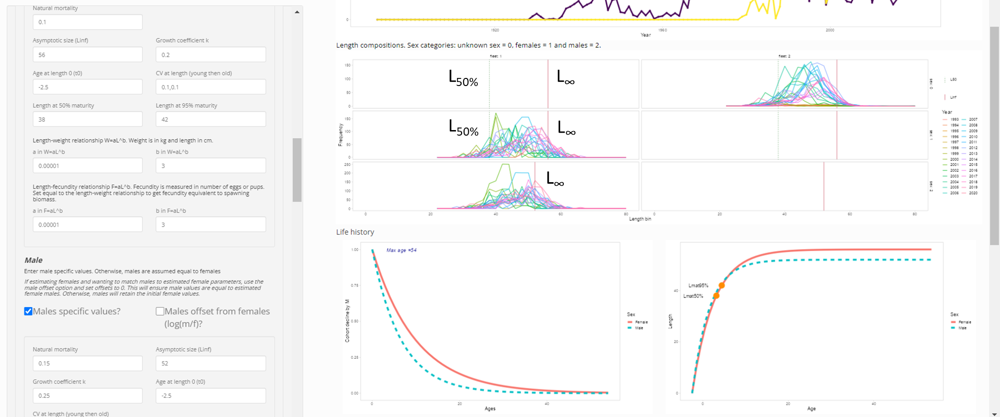More advanced life history configurations (e.g., different natural mortality assumptions, growth curves and stock-recruit relationships; time-varying parameters) can be achieved once the simpler models files are created, modified, then re-run in the SAC tool. Recruitment estimation is also an option, again freeing up the modelling to do more with the available data than other data-limited approaches using the same data.

When integrating data types, there is the need to consider how data are being weighted in the model. The SAC Tool provides easy access to multiple data-weighting options.

### Analyses/Outputs

A full compliment of plots and tables (via the [{r4ss}](https://github.com/r4ss/r4ss) package) for each model run is created and presented as is additional screen output for immediate interpretation. This include model diagnostics (convergence criteria, parameter output, data fits) and model derived outputs common to SS3 models. All typical SS3 outputs files are retained in the "Scenarios" folder withing a folder with the name given to the model. As long as the user renames each model before running it, all model outputs will be retained in the "Scenarios" folder. Running a model with the same name as another in the "Scenarios" folder will overwrite it.

*Example of the html output of diagnostics and derived model outputs. Each tab provides detailed and visuals of specified outputs.*

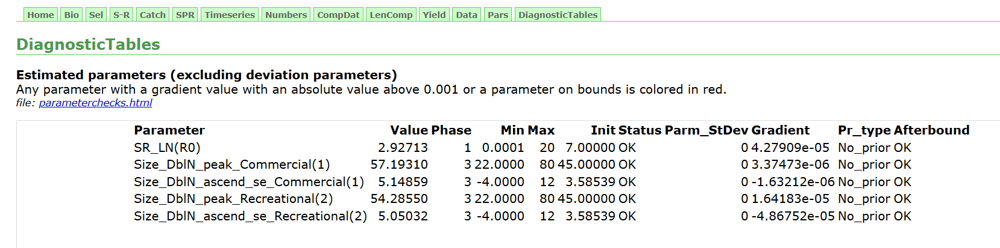

*SAC Tool Model output tab that provides basic model outputs and interactive tables.*

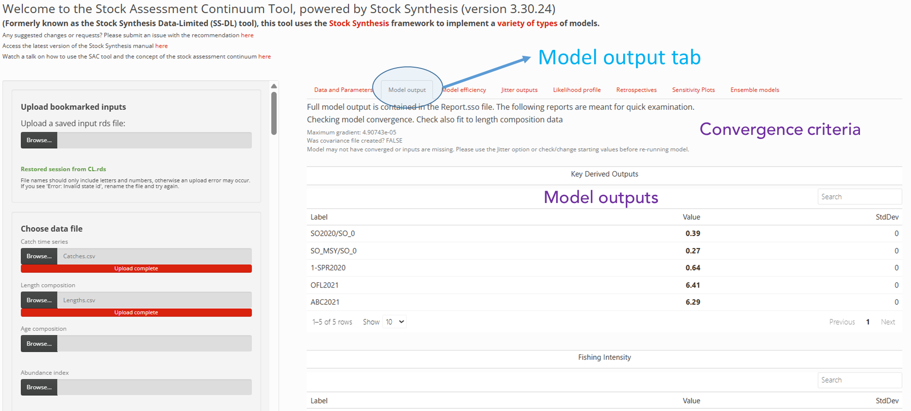

The SS3 Report.sso file contains extensive model output, including management outputs and forecasts.

#### Additional available analyses

The SAC Tool provides a variety of additional model exploratory analyses, many supporting uncertainty characterization and management decision making. The following is a list of additionally available analytical options. In addition to the plots shown below, all plots, tables and model outputs affiliated with the below analysis are saved in the output folder within the Scenarios folder of the SAC Tool.

- *Model efficiency:* This tab allows an already constructed model to explore what estimated parameters may be slowing model estimation down. A short Bayesian model is run to show which parameters show limited movement when running MCMC chains. These are candidates for pre-specifying the values, thus avoiding the limited movement during estimation to slow the model down while looking for a better gradient.

  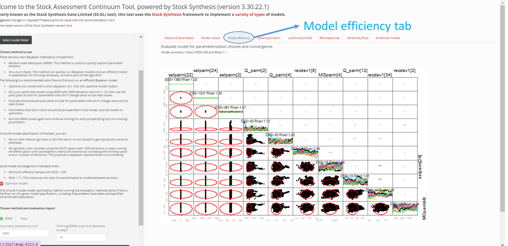

- *Jitter outputs:* To jitter a model means using different staring values for each model run to ensure local likelihood minima are being avoided when reaching a final model. This tab reports the results of the jitter analysis one could choose when setting up the original model in the "Data and Parameters" tab.

  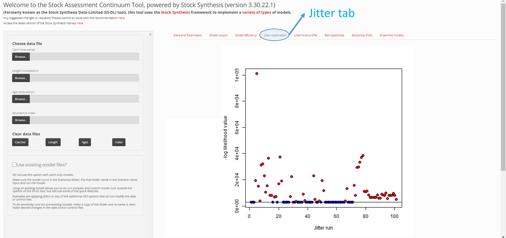

- *Likelihood profiles:* Likelihood profiles characterize the uncertainty in model derived outputs across values of a specified input. Likelihood profiling is useful to illustrate information content sufficiency for parameter estimation as well as how sensitive model derived outputs are to a change in a given parameter.

  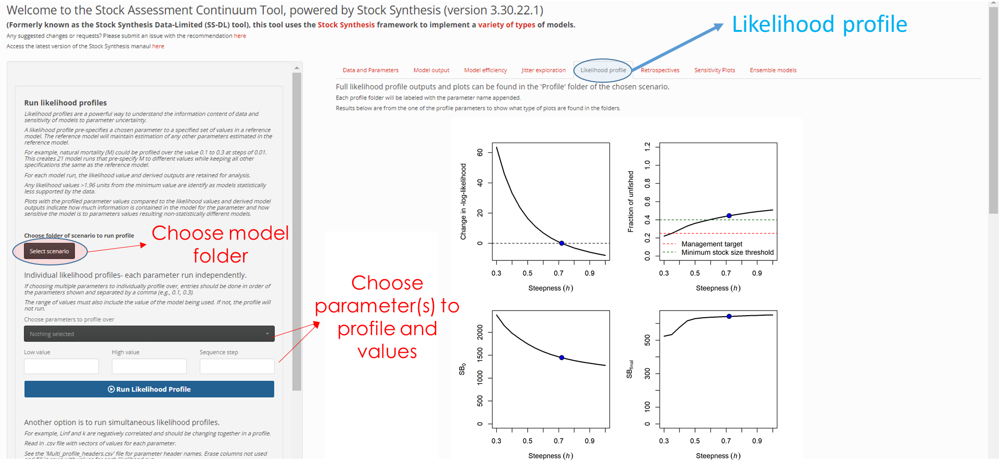

- *Retrospectives:* Retrospective analysis offers insight into how sensitive the current model output is to removal of data sequentially back in time. A commonly used approach to evaluate model robustness, it is easily to apply to any model constructed in the SAC Tool, including data-limited ones.

  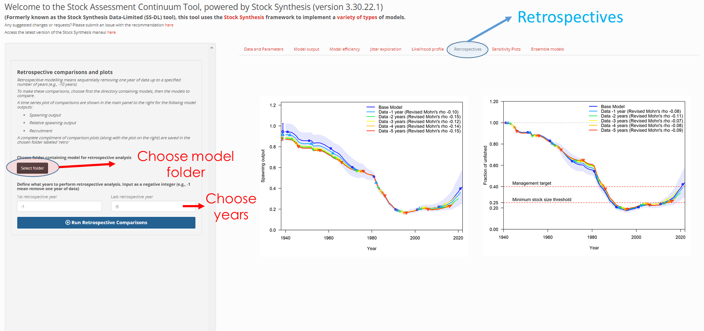

-  *Sensitivity Plots:* Proper characterization of model uncertainty requires running several formulations of a model in order to explore uncertainty around assumptions. These assumptions can include pre-specified parameter values, functional forms, data treatment, etc. This tab allow ones to compare the outputs of a variety of models by simply choosing which models to use. In addition to the numerous comparison plots it creates, it also creates comparison tables that include model fit, parameter values and key derived model outputs.

  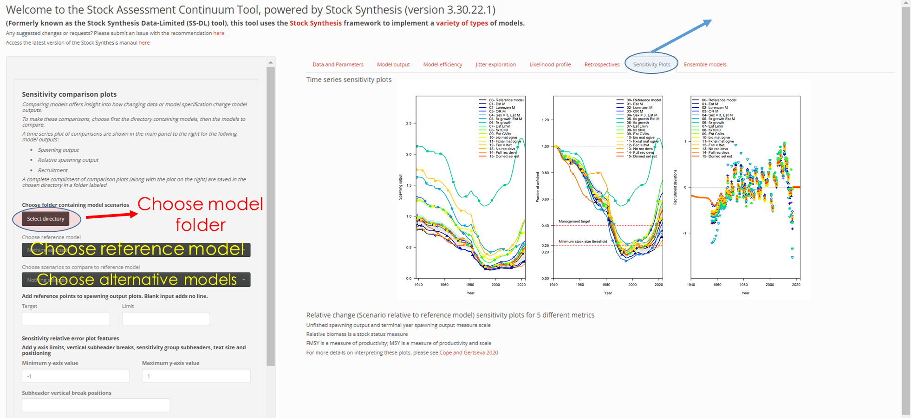

- *Ensemble models:* The concept of ensemble modelling takes the idea above of different models being hypotheses of different model specifications and blends selected ones into an overall output. Like the above sensitivity analyses, the user chooses which models to blend together based on their choice of how to weight each model in the ensemble.

  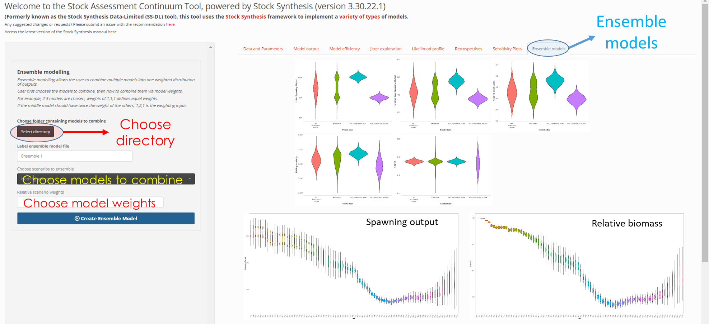

### Implications for Management

The above system of modelling provides management output under a variety of data availability conditions. These model outputs are familiar outputs used to make fisheries management decisions (e.g., stock status relative to fishing mortality, MSY and/or and unfished condition; catch limits). Different modelling configurations offer different management outputs, and the SAC Tool will report those appropriate to the data availability. The ability to do extensive uncertainty characterization is also a critical aspect for informed decision making, and the SAC Tool highlights a multitude of ways to present uncertainty to decision makers. This tool therefore supports management decision making regardless of where one resides on the data, and therefore stock assessment, continuum (Macpherson et al. 2022).

An additional benefit of using an integrated system like SS3 is that you can also leverage the forecasting and harvest control rule applications built in the framework. Thus forecasting catches under different control rule applications moves beyond just current stock status reporting and into tactical management advice, and applicable to any model built in the SAC Tool.

### Caveats

The tool aims to make integrated modelling more accessible to a variety of users. It also attempts to lay bear the assumptions of models and forces the user to confront these assumptions, while providing a way to explore those assumptions. Although this system is built to be user friendly, it still requires attention to data use, model configuration, and elevated training on how to access all of the output. The idea of maximum likelihood estimation, convergence criteria, and diagnosing model misbehavior can still take an elevated understanding of modelling theory. Users may also be overwhelmed with the amount of information coming out of the models. So while this is meant to be more accessible, it is also using a complex integrated modelling system that one may be intimidated by or consider is a black box without a deeper understanding of what it is doing.

## Applications

Numerous application have been used around the world. A selection of published examples are listed in the References section.

## Discussion

The SAC Tool provides a unified framework to traverse a variety of model-based data-limited methods. It encourages model exploration and confronting model assumptions. It questions what information content is contained in each data source, and allows different treatments within (e.g., multiple fleets) and among data types to avoid simplifying assumptions that constrain other data-limited models. Having a unified framework allows model development while retaining similar outputs, encouraging consistent reporting to managers. It also welcomes the inclusion of additional data and data types in the future, knowing it can all be incorporated in the same framework. By developing a consistent system of modelling, more attention can be put towards stakeholder engagement, communication and fisheries management decision making.

## References

Braccini, M., Hesp, A., Cope, J., Rynvis, L., Watt, M., Syers, C., Jackson, G., Newman, S., 2026. Multidecadal Management Ensures High Sustainability and Low Risk in a Global Shark Biodiversity Hotspot. Fish and Fisheries 27, 24–40. <https://doi.org/10.1111/faf.70030>

Cope, J.M., 2024. The good practices of practicable alchemy in the stock assessment continuum: Fundamentals and principles of analytical methods to support science-based fisheries management under data and resource limitations. Fisheries Research 270, 106859. <https://doi.org/10.1016/j.fishres.2023.106859>

Dichmont, C.M., Dowling, N.A., Punt, A.E., Pascoe, S., Deng, R.A., Van Putten, I., Cope, J.M., 2025. Helping to Build Stock Assessment Capacity in Australia: A Case Study. Fish and Fisheries 26, 1075–1086. <https://doi.org/10.1111/faf.70018>

Eighani, M., Cope, J.M., Raoufi, P., Naderi, R.A., Bach, P., 2021. Understanding fishery interactions and stock trajectory of yellowfin tuna exploited by Iranian fisheries in the Sea of Oman. ICES Journal of Marine Science 78, 2420–2431. <https://doi.org/10.1093/icesjms/fsab114>

Macpherson, M., Cope, J., Lynch, P., Furnish, A., Karp, M., Berkson, J., Lambert, D., Brooks, L., Siegfried, K., Dick, E., Tribuzio, C., 2022. National Standard 1 Technical Guidance on Managing with ACLs for Data- Limited Stocks: Review and Recommendations for Implementing 50 CFR 600.310(h)(2) Flexibilities for Certain Data-Limited Stocks, NOAA Tech. Memo.

Methot, R.D., Wetzel, C.R., 2013. Stock synthesis: A biological and statistical framework for fish stock assessment and fishery management. Fisheries Research 142, 86–99. <https://doi.org/10.1016/j.fishres.2012.10.012>

Min, M.A., Cope, J., Lowry, D., Selleck, J., Tonnes, D., Andrews, K., Pacunski, R., Hennings, A., Scheuerell, M.D., 2023. Data-limited fishery assessment methods shed light on the exploitation history and population dynamics of Endangered Species Act-listed Yelloweye Rockfish in Puget Sound, Washington. Marine and Coastal Fisheries 15, e10251. <https://doi.org/10.1002/mcf2.10251>

Soares, A., Cope, J., Lourenço, M., Barreto, T., Ferreira, B., Olavo, G., Frédou, T., 2025. 20 Years Later: Updated Stock Assessment of Snappers in Northeast Brazil Using an Integrated Stock Assessment Framework. Fisheries Management Eco fme.70008. <https://doi.org/10.1111/fme.70008>

Tagliarolo, M., Cope, J., Blanchard, F., 2021. Stock assessment on fishery-dependent data: Effect of data quality and parametrisation for a red snapper fishery. Fisheries Management and Ecology 28, 592–603. <https://doi.org/10.1111/fme.12508>

Weyl, O.L., M’balaka, M.S., Sharma, R., Cope, J., Kafumbata, D., 2023. Modelling the current status of Lake Malawi fish stocks, an inland lake in East Africa. Aquatic Ecosystem Health & Management 26, 26–39. <https://doi.org/10.14321/aehm.026.03.26>
